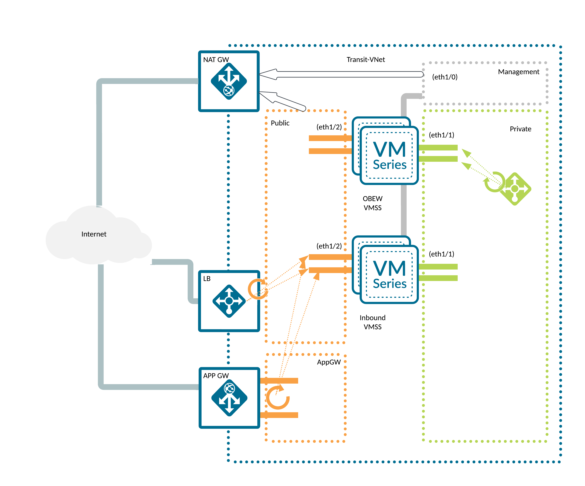

# Palo Alto Networks VM-Series Scaleset Module Example

An example of a Terraform module that deploys Next Generation Firewalls and related resources following the Dedicated Firewall reference architecture. In module a Virtual Machine Scale Set is used to run the Next Generation Firewalls. Thanks to custom, data plane oriented metrics published by PanOS it is possible to adjust the number of firewall appliances to the current workload (data plane utilization).

A Virtual Machine Scale Set is dynamic in nature, firewalls can be added or removed automatically, hence they cannot be managed in a classic way. Therefore they are not assigned with a public IP address. To ease licensing, management and updates a Panorama appliance is suggested. Deployment of a Panorama is not covered in this example, a [dedicated one exists](../standalone_panorama/README.md) though.

**NOTE:**

* after the deployment the firewalls remain not configured and not licensed
* this example contains some **files** that **can contain sensitive data**, namely the `TFVARS` file can contain bootstrap_options properties in `var.vmseries` definition. Keep in mind that **this code** is **only an example**. It's main purpose is to introduce the Terraform modules. It's not meant to be run on production in this form.

## Topology and resources

A note on resiliency - this is an example of a none zonal deployment. Resiliency is maintained by using fault domains (Scale Set's default mechanism).

This example architecture consists of:

* a VNET containing:
  * 4 subnets:
    * 3 of them dedicated to the firewalls: management, private and public
    * one dedicated to an Application Gateway
  * Route Tables and Network Security Groups
* 2 Virtual Machine Scale sets:
  * one for inbound, one for outbound, east-west traffic
  * with 3 network interfaces: management, public, private
  * no public addresses are assigned to firewalls interfaces
* 2 Load Balancers:
  * public - with a public IP address assigned, in front of the public interfaces of the inbound VMSS, for incoming traffic
  * private - in front of the firewalls private interfaces of the OBEW VMSS, for outgoing and east-west traffic
* a NAT Gateway responsible for handling the outgoing traffic for the management (updates) and public (outbound traffic in OBEW firewalls mainly) interfaces
* 2 Application Insights, one per each scale set, used to store the custom PanOS metrics
* an Application Gateway, serving as a reverse proxy for incoming traffic, with a sample rule setting the XFF header properly

### Architecture diagram



## Prerequisites

A list of requirements might vary depending on the platform used to deploy the infrastructure but a minimum one includes:

* (in case of non cloud shell deployment) credentials and (optionally) tools required to authenticate against Azure Cloud, see [AzureRM provider documentation for details](https://registry.terraform.io/providers/hashicorp/azurerm/latest/docs#authenticating-to-azure)
* [supported](#requirements) version of [`Terraform`](<https://developer.hashicorp.com/terraform/downloads>)
* if you have not run Palo Alto NGFW images in a subscription it might be necessary to accept the license first ([see this note](../../modules/vmseries/README.md#accept-azure-marketplace-terms))

A non-platform requirement would be a running Panorama instance. For full automation you might want to consider the following requirements:

* a template and a template stack with `DAY0` configuration
* a device group with security configuration (`DAY1` [iron skillet](https://github.com/PaloAltoNetworks/iron-skillet) for example) + any security and NAT rules of your choice
* a [Panorama Software Firewall License](https://docs.paloaltonetworks.com/vm-series/9-1/vm-series-deployment/license-the-vm-series-firewall/use-panorama-based-software-firewall-license-management) plugin to automatically manage licenses on newly created devices
* a [VM-Series](https://docs.paloaltonetworks.com/panorama/9-1/panorama-admin/panorama-plugins/plugins-types/install-the-vm-series-plugin-on-panorama) plugin to enable additional template options (custom metrics)

## Deploy the infrastructure

Steps to deploy the infrastructure are as following:

* checkout the code locally (if you haven't done so yet)
* copy the [`example.tfvars`](./example.tfvars) file, rename it to `terraform.tfvars` and adjust it to your needs (take a closer look at the `TODO` markers). If you already have a configured Panorama (with at least minimum configuration described above) you might want to also adjust the `bootstrap_options` for each scale set ([inbound](./example.tfvars#L205) and [obew](./example.tfvars#L249) separately).
* (optional) authenticate to AzureRM, switch to the Subscription of your choice if necessary
* initialize the Terraform module:

      terraform init

* (optional) plan you infrastructure to see what will be actually deployed:

      terraform plan

* deploy the infrastructure (you will have to confirm it with typing in `yes`):

      terraform apply

  The deployment takes couple of minutes. Observe the output. At the end you should see a summary similar to this:

      Apply complete! Resources: 52 added, 0 changed, 0 destroyed.

      Outputs:

      lb_frontend_ips = {
      "private" = {
          "ha-ports" = "1.2.3.4"
      }
      "public" = {
          "palo-lb-app1-pip" = "1.2.3.4"
      }
      }
      metrics_instrumentation_keys = <sensitive>
      password = <sensitive>
      username = "panadmin"

* at this stage you have to wait couple of minutes for the firewalls to bootstrap.

## Post deploy

The most important post-deployment action is (for deployments with auto scaling and Panorama) to retrieve the Application Insights instrumentation keys. This can be done by looking up the AI resources in the Azure portal, or directly from Terraform outputs:

```sh
terraform output metrics_instrumentation_keys
```

The retrieved keys should be put into appropriate templates in Panorama and pushed to the devices. From this moment on custom metrics are being sent to Application Insights and retrieved by Virtual Machine Scale Sets to trigger scale-in and scale-out operations.

Although firewalls in a Scale Set are not meant to be managed directly, they are still configured with password authentication. To retrieve the initial credentials run:

* for username:

      terraform output username

* for password:

      terraform output password

## Cleanup

To remove the deployed infrastructure run:

```sh
terraform destroy
```
